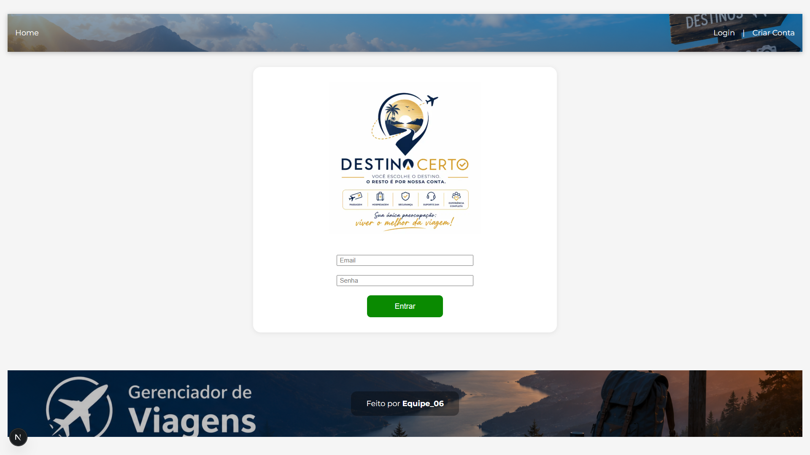
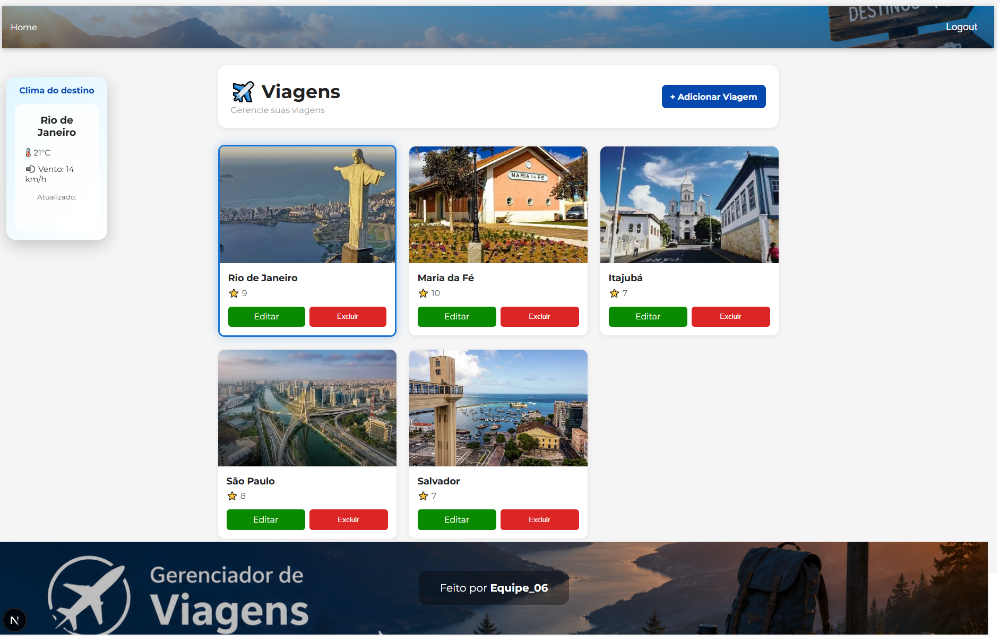
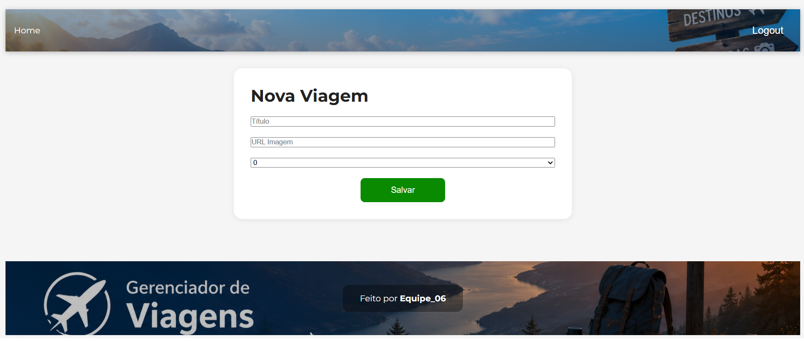
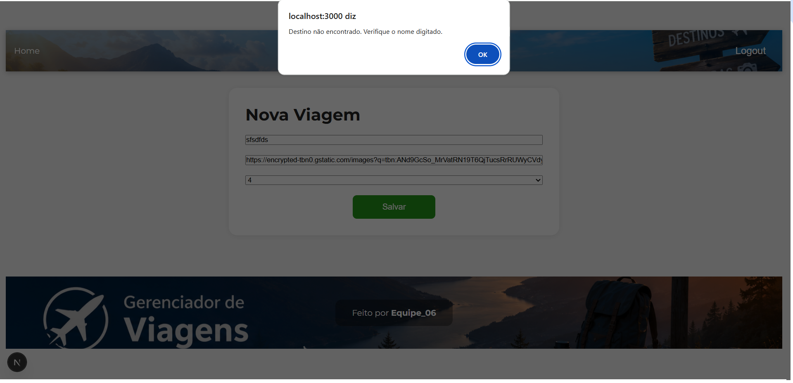
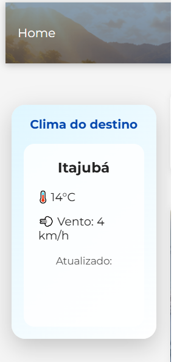

# ✈️ Travel Manager - Frontend

O **Travel Manager** é o frontend de uma aplicação web desenvolvida para o gerenciamento de viagens. O sistema permite que usuários autenticados cadastrem, editem, excluam e consultem destinos turísticos de forma simples e intuitiva.

Como diferencial, o sistema integra uma **API externa de clima**, permitindo consultar as condições climáticas do destino selecionado em tempo real, além de validar automaticamente o destino informado durante o cadastro.

---

# Funcionalidades

     - Login de usuários
     - Cadastro de novos usuários
     - Logout
     - Autenticação utilizando JWT
     - Validação de formulários com ZOD
     - Envio do Token para o backend através de Cookies
     - Cadastro de viagens
     - Listagem de viagens
     - Edição de viagens
     - Exclusão de viagens
     - Validação automática do destino utilizando uma API externa antes do cadastro
     - Consulta do clima em tempo real do destino selecionado
     - Interface personalizada com tema de viagens
     - Header e Footer personalizados

# Tecnologias Utilizadas

     - Next.js
     - React
     - TypeScript
     - CSS
     - Fetch API
     - ZOD
     - Sonner
     - JWT
     - API pública wttr.in

---

# API Externa

O projeto utiliza a API pública **wttr.in** para consultar as condições climáticas dos destinos cadastrados.

Além disso, utiliza uma API de geolocalização para **validar automaticamente o destino informado pelo usuário antes do cadastro**, impedindo o registro de locais inexistentes.

### APIs utilizadas

#### 1. Open-Meteo Geocoding API

Responsável por validar se o destino informado existe.

Exemplo:

```text
     https://geocoding-api.open-meteo.com/v1/search?name=Paris&count=1&language=pt&format=json
```

#### 2. wttr.in

Responsável por fornecer as condições climáticas do destino selecionado.

Exemplo:

```text
     https://wttr.in/Rio%20de%20Janeiro?format=j1
```

As APIs são utilizadas para:

     - Validar automaticamente o destino antes do cadastro da viagem;
     - Consultar a temperatura atual;
     - Exibir a condição climática;
     - Informar a velocidade do vento;
     - Mostrar o horário da última atualização.


# Diferenciais

     - Autenticação de usuários utilizando JWT.
     - Senhas protegidas por criptografia no backend.
     - Validação de formulários utilizando ZOD.
     - Validação automática de destinos por meio de API externa antes do cadastro.
     - Consulta do clima em tempo real para o destino selecionado.
     - Interface personalizada com tema de viagens.
     - Header e Footer customizados.
     - Componente interativo de clima exibido ao selecionar uma viagem.


# Estrutura do Projeto

```
src
│
├── app
├── componentes
│   ├── Footer
│   ├── Header
│   ├── HomeClient
│   ├── LoginForm
│   ├── ViagemCard
│   ├── ViagemForm
│   ├── ViagensGrid
│   └── WeatherSidebar
│
├── schemas
│
├── services
│
└── tipos
```

---

# Instalação

Clone o repositório e instale as dependências.

```bash
     npm install
```

Caso seja necessário instalar manualmente as bibliotecas utilizadas:

```bash
     npm install sonner
     npm install zod
```

---

# Configuração

Criar um arquivo `.env` na raiz do projeto contendo:

```
     NEXT_PUBLIC_API_URL=http://localhost:3001
```

---

# Execução

Executar a aplicação com:

```bash
     npm run dev
```

A aplicação será iniciada em:

```
     http://localhost:3000
```

> **Importante:** O backend deverá estar em execução na porta **3001** para que todas as funcionalidades estejam disponíveis.

---

# Screenshots

## Tela de Login



---

## Página Principal



---

## Cadastro de Viagem



---

## Cadastro de Viagem



---

## Consulta de Clima




---

# Integrantes

| Integrante | GitHub |
|------------|--------|
| Rafael Ramos da Silva | [@ramosprof](https://github.com/ramosprof) |
| Pedro Henrique Campos | [@Phpfcampos](https://github.com/Phpfcampos) |

---

# Licença

Projeto desenvolvido para fins acadêmicos na disciplina de Desenvolvimento Web.


